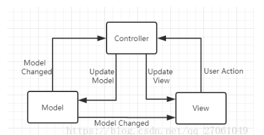

# **常用开发设计模式学习**

&nbsp;&nbsp;&nbsp;&nbsp;
常用的架构模式使用示例，MVVM、MVC、MVP、MVI等软件架构，解析架构理念，分析优缺点。 
&nbsp;&nbsp;&nbsp;&nbsp;
架构发展历史，MVC、。

框架模式：MVC、MTV、MVP、CBD、ORM等
框架：Qt、MFC、SSH、.Net、Spring等
设计模式：工厂模式、适配器模式、策略模式等
设计模式六大原则：

+ 开闭原则 Open Close Principle
+ 里氏代换原则 Liskov Substitution Principle
+ 依赖倒转原则 Dependence Segregation Principle
+ 接口隔离原则 Interface Segregation Principle
+ 迪米特法则 Demeter Principle
+ 合成复用原则 Composite Reuse Principle

---

参考链接：

> https://www.jianshu.com/p/69fadffd0d7d
> [设计模式](https://www.runoob.com/design-pattern/mvc-pattern.html)
> [架构模式,相互持有不建议](https://zhuanlan.zhihu.com/p/83635530)
> [MVVM](https://www.zhihu.com/question/485445849)
> [MVI](https://www.jianshu.com/p/353e882ee410)

---

## MVC - Model View Control

&nbsp;&nbsp;&nbsp;&nbsp;经典MVC模式中，M指业务模型，V指用户界面，C则是控制器，
使用MVC的目的是将M和V的实现代码分离，从而使一个程序可以使用不同的表现形式,
C的存在用来保证M和V的同步更新。

android中MVC模式运用，M用来保存数据状态，如数据存储，网络请切记，数据数据等，同时
与View存在一定的耦合，通过某种事件机制（观察者模式），通知View更新。可以将xml-->
View，Activity --> Control。View产生事件，通知到Control进行一系列逻辑处理，
再通知给Model更新数据，通知View更新界面。

| 关联                                                            | 联系           | 联系                 |
| ----------------------------------------------------------------- | ---------------- | ---------------------- |
| Control - View                                                  | 控制view       | 点击、触摸事件       |
| Control - Model                                                 | 数据获取、处理 | 渲染数据             |
| View - Model                                                    | unknown        | 观察者模式，更新view |
| View 接收用户输入， Control 判断用户输入， Model 业务逻辑处理。 |                |                      |

### 示例ctrl_1

Control- Control1_Activity,
View -> activity_control_001.xml&Control1_Activity,
Model -> Control1_Model

### 示例ctrl_2

Control- Control2_Activity, Control2_Control
View -> activity_control_002.xml&Control2_Activity,
Model -> Control2_Model

### MVC 分析优缺点

+ 业务逻辑与视图设计分离；
+ View与Model之间可以相互产生影响，导致耦合度高，模块界限模糊；
+ Activity 中代码容易积累，量大，同时兼任了View与Control角色，违反‘单一职责’原则；

## MVP - Model View Presenter

&nbsp;&nbsp;&nbsp;&nbsp;MVP是MVC的一个演化版本，Activity中处理View，业务逻辑由Presenter处理，
即MVP分担了MVC中Activity中同时处理View与Control的工作，解耦Model与View。

### 示例 presenter_1

interface : IModel, IPresenter, IView
class: Activity, Presenter, Model
其他： xml
将View和Model解耦，全部由Presenter作为中间人交互，View和Model比相互持有。
MVP 和 MVC 最大的不同，就是 View 和 Model 不相互持有，都通过 Presenter 做中转。
View 产生事件，通知给 Presenter，Presenter 中进行逻辑处理后，通知 Model 更新数据，
Model 更新数据后，通知数据结构给 Presenter，Presenter 再通知 View 更新界面。

### MVP 分析优缺点

+ 结构相较于MVC更清晰，职责划分更清晰，解耦程度更高
+ Model与View解耦
+ 引入大量的接口，项目文件增多，代码结构更复杂

## MVVM - Model View ViewModel

继MVP之后出现，谷歌出品（Jetpack), ViewModel+LiveData+lifecycles 出现，MVVM框架问世。
MVVM是一种设计思想，Model层代表数据模型，可以在Model中定义数据的修改和操作的业务逻辑，View代表的Ui组件，
负责将数据模型转化为UI展示出来，ViewModel是核心，是一个负责同步View和Model的对象，
是View和Model层之间的调度者，它从Mode层中取出数据的同时还帮忙处理View层需要展示的内容涉及的业务逻辑。
在MVVM的架构下，View与Model之间没有直接的联系，而是通过ViewModel进行交互，Model与View之间的交互是双向的，
因此view数据的变化会同步到Model中，Model的数据的变化也会立即响应到View上。
ViewModel通过双向数据绑定把View层和Model层关联起来。

### 数据驱动

在常规的开发模式中，数据变化需要更新UI的时候，需要先获取UI控件的引用，然后再更新UI。
获取用户的输入和操作也需要通过UI控件的引用。在MVVM中，这些都是通过数据驱动来自动完成的，
数据变化后会自动更新UI，UI的改变也能自动反馈到数据层，数据成为主导因素。
这样MVVM层在业务逻辑处理中只要关心数据，不需要直接和UI打交道，在业务处理过程中简单方便很多。

### 低耦合度

数据和业务逻辑处于一个独立的ViewModel中，ViewModel只需要关注数据和业务逻辑，
不需要和UI或者控件打交道。UI想怎么处理数据都由UI自己决定，ViewModel不涉及任何和UI相关的事，
也不持有UI控件的引用。即便是控件改变了（比如：TextView换成EditText），
ViewModel也几乎不需要更改任何代码。它非常完美的解耦了View层和ViewModel，
解决了上面我们所说的MVP的痛点。

### 示例mvvm_001
    ViewModel 与Model 相互持有，不建议
### 示例mvvm_002
    ViewModel 单独持有model， 通过接口交互
### 示例mvvm_003
    ViewModel 应用，@MainThread
    ViewModel类被设计为通过lifecycle感知的方式存储和管理ui相关数据。
    ViewModel对象被视为lifecycle传递给ViewModelProvider.ViewModel一直保留在内存中，
    直到它的作用域永久消失：在activity的情况下，当它finishes时，
    而在fragment的情况下，当它被detached时。
### MVVM 优缺点

+ ViewModel与View属于双向交互，具有绑定关系
+ ViewModel 与Model 的界限模糊

## MVI Model View Intent

MVI基于MVVM提出，将ViewModel&View双向交互变为View->Intent->ViewModel->State->View 环形交互。
